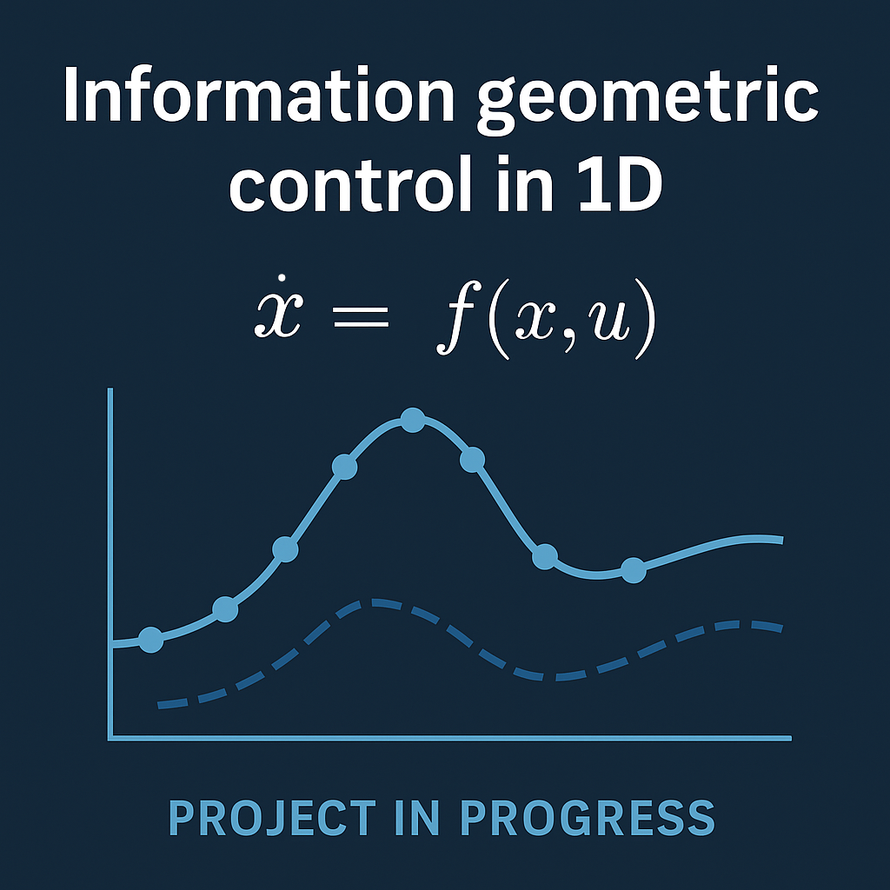

This is a **work-in-progress** Python project that uses [CasADi](https://web.casadi.org/) to simulate and control one-dimensional dynamical systems using a structured, object-oriented design.

## 🚀 Current Features

- Object-oriented implementation of a simple control loop for systems of the form:
  \[
  \dot{x} = f(x, u)
  \]
- Model Predictive Control (MPC) for state regulation.
- Modular structure with separate components for models, controllers, and simulators.
- Streamlit interface with interactive Plotly visualizations in the browser.

## 🎯 Project Goal

The final objective of this project is to extend the control formulation to **stochastic systems** of the form:
\[
\dot{x} = f(x, u) + w(t)
\]
where \( w(t) \) is a **Wiener process** (Brownian motion).

We aim to:
- Model the **evolution of the system's probability distribution** over time.
- Introduce a **cost function based on the total information length**, i.e. the geometric length traversed by the system's probability distribution on the statistical manifold.
- Apply principles from **information geometry** to design novel control strategies.

## 📁 Project Structure

```
casadi_control_project/
├── models/             # Dynamical models
├── controllers/        # Control strategies (e.g., MPC)
├── simulators/         # Trajectory simulation
├── utils/              # Plotting and helpers
├── main.py             # Streamlit-based app entry point
└── README.md
```

## 🛠 Requirements

- Python 3.10+
- CasADi
- Streamlit
- Plotly

Install via:

```bash
pip install casadi streamlit plotly
```

## 📈 Running the App

Launch the interactive simulation in your browser:

```bash
streamlit run main.py
```

## 📬 Contributions

Pull requests and discussions are welcome as this project evolves toward its stochastic control goals.

## 📄 License

MIT License